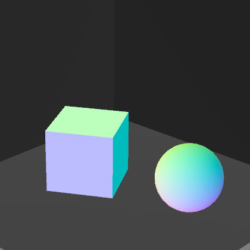
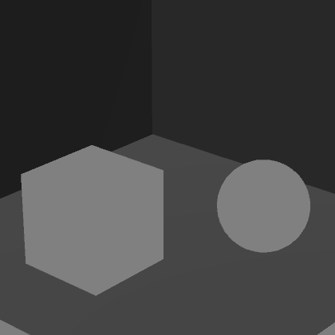
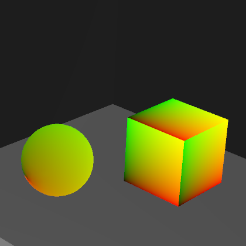
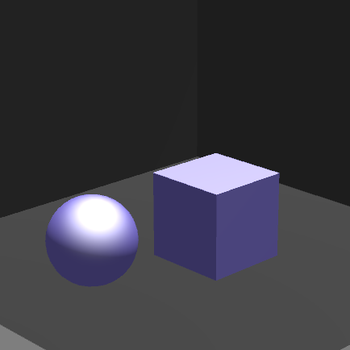

# Portfolio_Deferred-Shading

중부대학교 게임소프트웨어학과 91913256_김재훈

## Introduce

Normal.shder  

Color.shader  

Position.shader  

Specular.shader  

<table align="center">
  <tr>
    <th style="text-align: center;">Normal</th>
    <th style="text-align: center;">Color</th>
    <th style="text-align: center;">Position</th>
    <th style="text-align: center;">Specular</th>
  </tr>
  <tr>
    <td></td>
    <td></td>
    <td></td>
    <td></td>
  </tr>
</table>

## Style transfer 결과

<table align="center">
  <tr>
    <th style="text-align: center;">Normal</th>
    <th style="text-align: center;">Color</th>
    <th style="text-align: center;">Position</th>
    <th style="text-align: center;">Specular</th>
  </tr>
  <tr>
    <td></td>
    <td></td>
  </tr>
</table>

<table align="center">
  <tr>
    <th style="text-align: center;">Epoch: 20</th>
    <th style="text-align: center;">Epoch: 100</th>
  </tr>
  <tr>
    <td></td>
    <td></td>
  </tr>
</table>
